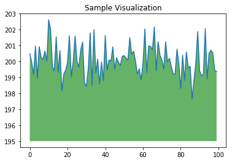

Colab allows to run and program Python in your browser, with no installations. Main features include:
* No configuration or setup required
* Free GPU and TPU access.
* Easy sharing of documents (notebooks), like if there were Google Docs or Sheets docs.
* Easy Github access.
* TensorFlow 2 already preinstalled.
* Targeted at students and research scientists. Colab is not targeted at enterprise production environments.

If you know the Jupyter project, Colab is a **Jupyter notebook stored in Google Drive**. Using a Google account, you can create a new notebook just by going to [colab.research.google.com](colab.research.google.com)

Colab connects your notebook to a cloud-based runtime, meaning you can execute python without any setup.

A notebook document is composed of cells, of two types: code and text cells. **Code cells** contain python code. **Text cells** allow to add headings, paragraph, images, lists, even mathematical formulas using Markdown. All cells are executed using CMD+ENTER.

Notebooks used in Colab follow .ipynb standard format, and can be shared using Google Drive, github or can download it to be used in other compatible frameworks, like Jupyter notebooks, Jupyterlab. Moreover, you can find Notebooks repositories aroudn internet, like the [TensorFlow Hub project](https://tfhub.dev/), where there are many notebooks available and can be directly open in Colab.

## Colab for data science and deep learning

Colab comes with **TensorFlow 2 preinstalled**. But you can use any other dee learnihng framework with python. Note however Colab does not support R or scala. Additionally, Colab can use and import any popular library to visualize data. For example, you can import `numpy` to generate data and visualize it using `matplotlib`.

```python
import numpy as np
from matplotlib import pyplot as plt

ys = 200 + np.random.randn(100)
x = [x for x in range(len(ys))]

plt.plot(x, ys, '-')
plt.fill_between(x, ys, 195, where=(ys > 195), facecolor='g', alpha=0.6)

plt.title("Sample Visualization")
plt.show()
```


|  | 
|:--:| 
| *Figure: Using numpy and matplotlib with Colab* |


## Using Colab with github

Opening and saving .ipynb files stored on Github is easy: just add your Github path to colab.research.google.com/github/ . For example, colab.research.google.com/github/tensorflow/tensor2tensor/blob/master/tensor2tensor/notebooks/hello_t2t.ipynb will directly load this ipynb stored on Github.

You can also easily save a copy of your Colab notebook to Github by using File > Save a copy to Github.

## Other notebook environemtns

* **CAIP notebooks** (or Google Cloud AI Platforms notebooks): is a Google Cloud platform product, a managed service for JupyterLab, enterprise-grade, built on top of DL VM images. It is executed in user projects, and is now part of AI Platform. 

* **Colaboratory Pro** (or Colab Pro): similar to Colab, is a Google Brain product, not part of Google Cloud. [Announced in February 2020](https://colab.research.google.com/notebooks/pro.ipynb), it's a paid-based product (USD 9.99 / month), which provides faster GPUs(T4, P100), high-memory VMs and longer runtimes (before runtimes were resetted every 12 hours)

Back to the [Index](../README.md)
