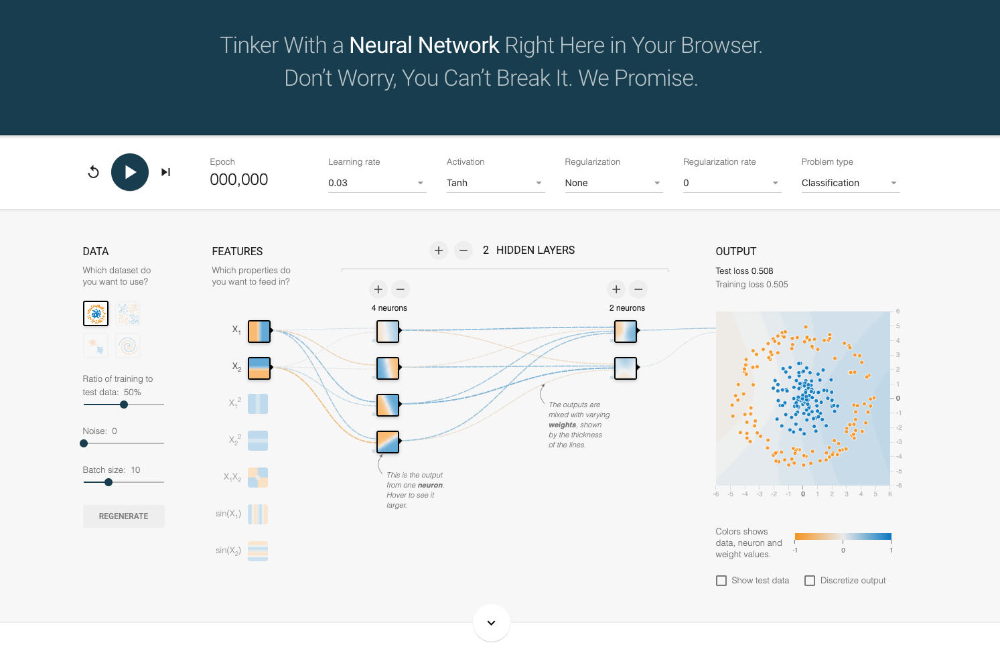
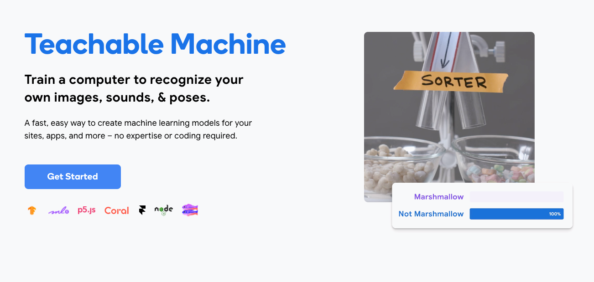

This page shows some tools you can use to learn more about deep learning technologies:

## TensorFlow playground

[TensorFlow playground](https://playground.tensorflow.org/) is an interactive visualization of neural networks, written in TypeScript using d3.js. The oen-source project, called **deep playground** is available in Github, and open for contributions.

TensorFlow playground allows to change the following **model hyperparmeters**, directly in the user interface:
* Learning rate: between 0.00001 and 10
* Activation: tanh, sigmoid, ReLU or linear.
* Regularization: L1, L2 or None.
* Regularization rate: between 0 to 10
* Problem type: regression or classification
* Numer of hidden layers

|  | 
|:--:| 
| *Figure: TensorFlow playground* |

## Teachable machine

[Teachable Machine](https://teachablemachine.withgoogle.com/) is a web-based tool that makes creating machine learning models fast, easy, and accessible to everyone.

You can make deep learning training with any of the following input types:
* **Images**, pulled from your webcam or image files.
* **Sounds**, in one-second snippets from your mic.
* **Poses**, where the computer guesses the position of your arms, legs, etc from an image.

Teachable Machine uses Tensorflow.js, a library for machine learning in Javascript, to train and run the models you make in your web browser.

After training, you can save your project entirely to Google Drive, in a .zip file that contains all the samples in each of your classes to Drive. Or you can download your model to use it externally.

|  | 
|:--:| 
| *Figure: Teachable machine* |

## MNIST and Fashion MNIST datasets

**MNIST database** (Modified National Institute of Standards and Technology database) is a database of handwritten digits (10 classes), used as a "Hello World" of image processing systems. it is a subset of a larger NIST database, created by Yann LeCun, Corinna Cortes,  and Christopher J.C. Burges. Contains grayscale images of 28x28 pixels, with 60,000 examples for training and 10,000 examples for testing.

More information and download [here](http://yann.lecun.com/exdb/mnist/).

**Fashion-MNIST database** is a dataset by Zalando, containing images of articles, with 10 classes and 60,000 examples for training and 10,000 examples for testing. Each example is a 28x28 grayscale image, associated with a label from 10 classes. Fashion MNIST tries to be a replacement of rthe original MNIST. 

More information and is available [here](https://github.com/zalandoresearch/fashion-mnist). 
