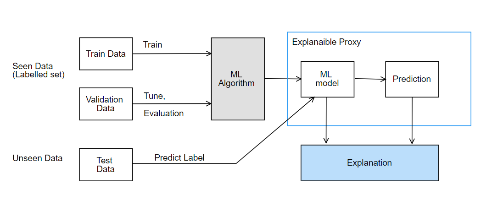

# Advanced topics
  * The importance of quality data: where the bias comes from
  * ML explainability: why this is hard
  * Why developers need to understand AI principles: https://ai.google/principles/
  * TFData
  * Pipelines

Back to the [Index](../README.md)

# The importance of quality data: where the bias comes from

# ML Explainability

As the compute resources and dataset sizes have increased overtime, more complex non-near models have been developed. We have seen a shift from the traditional rule based/heuristics to linear models, decision trees, followed by deep models and ensembles to even the concept of meta-learning where models are created by other models.

Although this advancement has brought a paradigm shift along multiple dimensions allowing models to have more:
- Expressiveness
- Versatility
- Adaptability
- Efficiency

On the flip side, more complex models become increasingly opaque. This is where model explainability becomes increasingly relevant. Model explainability is one of the most important problems in machine learning today. It’s often the case that certain “black box” models such as deep neural networks are deployed to production and are running critical systems. Understanding model behaviour is important to both model builders and model end users. 
Some of the simple definitions for ML explainability are as follows:
- Ability to explain or to present in understandable terms to a human
- The process of understanding how and why a machine learning model is making predictions

### Common methods used for ML explainability:
- Sampled Shapely
- Integrated gradients
- XRAI
- DeepLift

### ML explainability helps to:
- Identify feature importance
- Understand model behaviour
- Give insights into e.g
  * Why did the model predict a cat instead of a dog?
  * Why did a transaction get flagged as fraudulent instead of non-fraudulent?
  * Which parts of an image gave the highest signals for model prediction?
  * Which words in the sentence gave the highest signals for model prediction?
       
### How ML explainability fits into the ML lifecycle:

# Why developers need to understand AI principles

AI and other advanced technologies have incredible potential to empower people, widely benefit current and future generations, and work for the common good. But these same technologies also raise important challenges that we need to address clearly, thoughtfully, and affirmatively. Ai principles set out commitment to develop technology responsibly and establish specific application areas which should not be pursued.

## AI Principles by Google 

[[AI Principles by Google]](https://ai.google/principles/) is a concrete example of how a company might foster ethical principles. These principles set out Google's commitment to develop technology responsibly and establish specific application areas the company will not pursue. According these principles, Google will assess AI applications in view of the following objectives:

**Be socially beneficial**

The expanded reach of new technologies increasingly touches society as a whole. Advances in AI will have transformative impacts in a wide range of fields, including healthcare, security, energy, transportation, manufacturing, and entertainment. As we consider potential development and uses of AI technologies, we will take into account a broad range of social and economic factors, and will proceed where we believe that the overall likely benefits substantially exceed the foreseeable risks and downsides.

**Avoid creating or reinforcing unfair bias**

AI algorithms and datasets can reflect, reinforce, or reduce unfair biases. We recognize that distinguishing fair from unfair biases is not always simple, and differs across cultures and societies. We will seek to avoid unjust impacts on people, particularly those related to sensitive characteristics such as race, ethnicity, gender, nationality, income, sexual orientation, ability, and political or religious belief.

**Be built and tested for safety**

We will continue to develop and apply strong safety and security practices to avoid unintended results that create risks of harm. We will design our AI systems to be appropriately cautious, and seek to develop them in accordance with best practices in AI safety research. In appropriate cases, we will test AI technologies in constrained environments and monitor their operation after deployment.

**Be accountable to people**

We will design AI systems that provide appropriate opportunities for feedback, relevant explanations, and appeal. Our AI technologies will be subject to appropriate human direction and control.

**Incorporate privacy design principles**

We will incorporate our privacy principles in the development and use of our AI technologies. We will give opportunity for notice and consent, encourage architectures with privacy safeguards, and provide appropriate transparency and control over the use of data.

**Uphold high standards of scientific excellence**

Technological innovation is rooted in the scientific method and a commitment to open inquiry, intellectual rigor, integrity, and collaboration. AI tools have the potential to unlock new realms of scientific research and knowledge in critical domains like biology, chemistry, medicine, and environmental sciences. We aspire to high standards of scientific excellence as we work to progress AI development.

**Be made available for uses that accord with these principle**

Many technologies have multiple uses. We will work to limit potentially harmful or abusive applications. As we develop and deploy AI technologies, we will evaluate likely uses in light of the following factors:

  * Primary purpose and use: the primary purpose and likely use of a technology and application, including how closely the solution is related to or adaptable to a harmful use
  * Nature and uniqueness: whether we are making available technology that is unique or more generally available
  * Scale: whether the use of this technology will have significant impact
  * Nature of Google’s involvement: whether we are providing general-purpose tools, integrating tools for customers, or developing custom solutions

# TFData

# Pipelines

