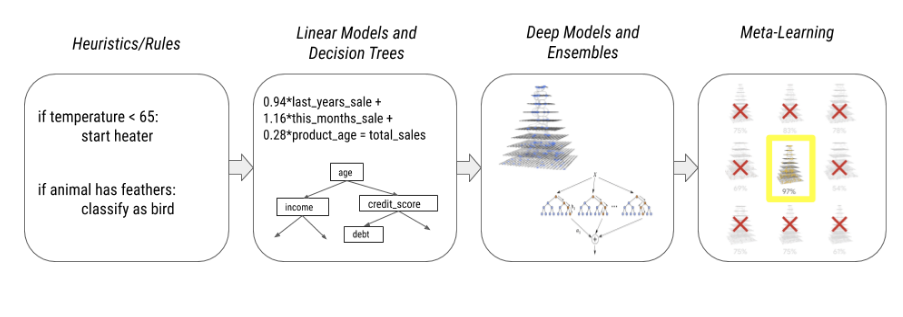

# Advanced topics
  * The importance of quality data: where the bias comes from
  * ML explainability: why this is hard
  * Why developers need to understand AI principles: https://ai.google/principles/
  * TFData
  * Pipelines

Back to the [Index](../README.md)

# The importance of quality data: where the bias comes from

# ML Explainability

As the compute resources and dataset sizes have increased overtime, more complex non-near models have been developed. We have seen a shift from the traditional rule based/heuristics to linear models, decision trees, followed by deep models and ensembles to even the concept of meta-learning where models are created by other models.

Although this advancement has brought a paradigm shift along multiple dimensions allowing models to have more:
- Expressiveness
- Versatility
- Adaptability
- Efficiency

On the flip side, more complex models become increasingly opaque. This is where model explainability becomes increasingly relevant. Model explainability is one of the most important problems in machine learning today. It’s often the case that certain “black box” models such as deep neural networks are deployed to production and are running critical systems. Understanding model behaviour is important to both model builders and model end users. 
Some of the simple definitions for ML explainability are as follows:
- Ability to explain or to present in understandable terms to a human
- The process of understanding how and why a machine learning model is making predictions

### Common methods used for ML explainability:
- Sampled Shapely
- Integrated gradients
- XRAI
- DeepLift

### ML explainability helps to:
- Identify feature importance
- Understand model behaviour
- Give insights into e.g
  * Why did the model predict a cat instead of a dog?
  * Why did a transaction get flagged as fraudulent instead of non-fraudulent?
  * Which parts of an image gave the highest signals for model prediction?
  * Which words in the sentence gave the highest signals for model prediction?
       
### How ML explainability fits into the ML lifecycle:

# Why developers need to understand AI principles

AI and other advanced technologies have incredible potential to empower people, widely benefit current and future generations, and work for the common good. But these same technologies also raise important challenges that we need to address clearly, thoughtfully, and affirmatively. Ai principles set out commitment to develop technology responsibly and establish specific application areas which should not be pursued.

[[AI Principles by Google:]](https://ai.google/principles/)
- Be socially beneficial
- Avoid creating or reinforcing unfair bias.
- Be built and tested for safety
- Be accountable to people
- Incorporate privacy design principles
- Uphold high standards of scientific excellence
- Be made available for uses that accord with these principle

# TFData

# Pipelines

